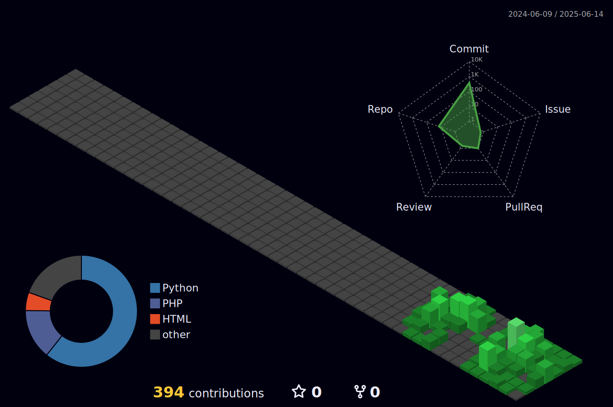

# Olá! Bem-vindo ao meu perfil no Github
## Meu nome é João Victor dos Reis da Silva, mas pode me chamar de Reis!
- Estudante de BES (Bacharelado em Engenharia de Software) na PUCPR - Pontifícia Universidade Católica do Paraná.
- Ainda não trabalho na área, mas estou estudando para conseguir uma vaga de estágio o quanto antes.
- Sou formado em técnico em eletrônica pelo IFPR - Instituto Federal do Paraná e lá tive experiências com a linguagem C, além de outros conhecimentos na área.

## 📚 Aprendizado atual
- PHP (foco em backend, criação de APIs e manipulação de banco de dados com MySQL)
- Python (estruturas de dados, automação, projetos)
- HTML & CSS
- Git e GitHub (controle de versão)

### 🔜 Próximos passos
- JavaScript 
- Projetos Web com HTML + CSS + JS

### 🛠️ Tecnologias e Ferramentas
   

## Contatos:

  
  
  

## Meu Perfil 3D — Tema Noturno Verde

<a href="https://github.com/R3I5">

         
